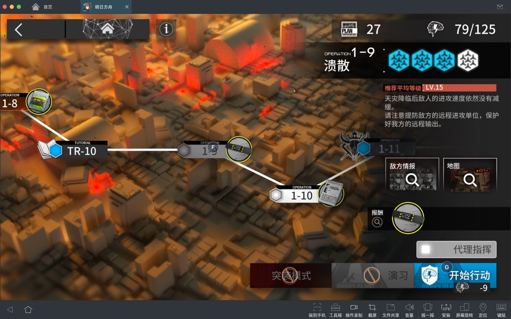
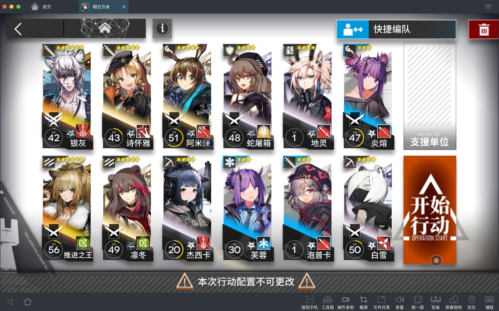
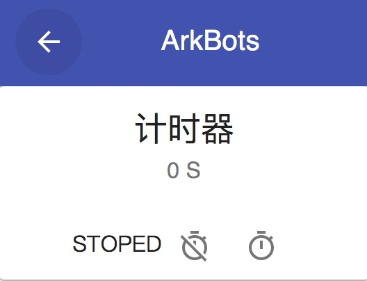

#AckBots - 明日方舟 自动化脚本

###支持平台

- MuMu模拟器
- Windows
- Mac(开发中) 

###使用说明

####后台模式
0. 打开mumu模拟器，进入游戏

1. 配置快捷键

   配置一个**关卡选择**快捷键

   配置一个**开始行动*（快捷键（注意，请确保该按键能够**同时覆盖** 关卡界面 和 编队界面 的开始行动按键

2. 记录单次自律所需时间

工具里有简单的计时器

3. 输入信息，点击开始

4. 可以把Mumu模拟器最小化了

   

### DEV
####todo 