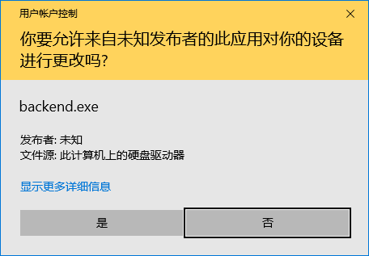
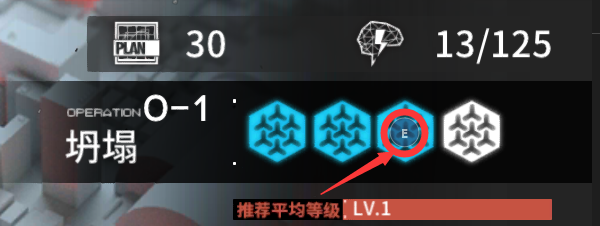

# AckBots - 明日方舟 自动化脚本
### Features
   - 模拟器最小化时依旧可以挂机
   
### 支持平台

- MuMu模拟器
- Windows
- Mac(开发中) 

### 使用说明

#### 后台模式
0. 当UAC窗口弹出时请单击确定，因为模拟器运行在管理员模式下，所以模拟按键程序也需要运行在管理员权限下。

   

   打开mumu模拟器，进入游戏
   

1. 配置快捷键

   配置一个**关卡选择**快捷键

   配置一个**开始行动**快捷键（注意，请确保该按键能够**同时覆盖** 关卡界面 和 编队界面 的开始行动按键

   配置一个**空白区域**快捷键，用于跳过战斗结算画面

2. 记录单次自律所需时间

工具里有简单的计时器

3. 输入信息，点击开始

4. 可以把Mumu模拟器最小化了

   

### For Developer
#### todo 